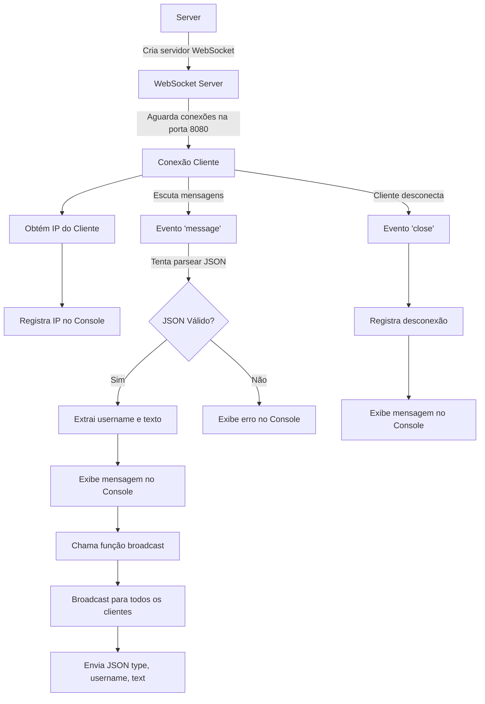

```mermaid
graph TD
    A[Server] -->|Cria servidor WebSocket| B[WebSocket Server]
    B -->|Aguarda conexões na porta 8080| C[Conexão Cliente]
    
    C --> D[Obtém IP do Cliente]
    D --> E[Registra IP no Console]
    
    C -->|Escuta mensagens| F[Evento 'message']
    F -->|Tenta parsear JSON| G{JSON Válido?}
    
    G -- Sim --> H[Extrai username e texto]
    H --> I[Exibe mensagem no Console]
    I --> J[Chama função broadcast]
    J --> K[Broadcast para todos os clientes]
    K --> L[Envia JSON type, username, text]
    
    G -- Não --> M[Exibe erro no Console]
    
    C -->|Cliente desconecta| N[Evento 'close']
    N --> O[Registra desconexão]
    O --> P[Exibe mensagem no Console]
```

