```mermaid
graph TD
    A[Início] -->|Cria servidor WebSocket| B[WebSocket Server]
    B -->|Aguarda conexões na porta 8080| C[Conexão Cliente]
    
    C --> D[Obtém IP do Cliente]
    D --> E[Registra IP no Console]
    
    C -->|Escuta mensagens| F[Evento 'message']
    F -->|Tenta parsear JSON| G{JSON Válido?}
    
    G -- Sim --> H[Extrai username e texto]
    H --> I[Exibe mensagem no Console]
    I --> J[Chama função broadcast]
    J --> K[Broadcast para todos os clientes]
    K --> L[Envia JSON type, username, text]
    
    G -- Não --> M[Exibe erro no Console]
    
    C -->|Cliente desconecta| N[Evento 'close']
    N --> O[Registra desconexão]
    O --> P[Exibe mensagem no Console]
```

```mermaid
graph TD
    A[Início] -->|Cria interface readline| B[CLI Interface]
    A -->|Conecta ao WebSocket| C[WebSocket Client]

    C -->|Evento 'open'| D[Solicita username]
    D -->|Usuário digita nome| E[Armazena username]
    E -->|Exibe mensagem de boas-vindas| F[Usuário pode enviar mensagens]

    F -->|Usuário envia mensagem| G[Evento 'line']
    G -->|Empacota JSON username, message| H[Envia para WebSocket]

    C -->|Evento 'message'| I[Recebe mensagem do servidor]
    I -->|Tenta parsear JSON| J{JSON Válido?}

    J -- Sim --> K[Verifica se type === 'message']
    K -- Sim --> L[Exibe mensagem formatada: username: texto]
    K -- Não --> M[Ignora mensagem]

    J -- Não --> N[Exibe erro no console]
```

# Server with WS Protocol and CLI client to communication

This project implement a server with support to WebSocket protocol, a CLI to communication with server and a simple front-end to log the message.

## 📌 Techs
- Node.js
- WebSocket
---

## 🚀 Websocket server (server.js)

### 📜 Description
The WebSocket server listens for connections on port `8080`, receives messages from clients, and retransmits them to all connected clients (broadcast)..

### 🔧 Setup

1. Install the dependencies:
   ```sh
   npm install
   ```
2. To up the server, run:
   ```sh
   node server.js
   ```

### 📌 Fluxogram


---

## 💻 CLI Client

### 📜 Description
The WebSocket CLI client allows a user to send messages typed at the terminal to the server, as well as receive messages from other connected users.

### 🔧 Instalação e Execução
1. To up the CLI, run:
   ```sh
   node client.js
   ```

### 📌 Fluxogram

---

